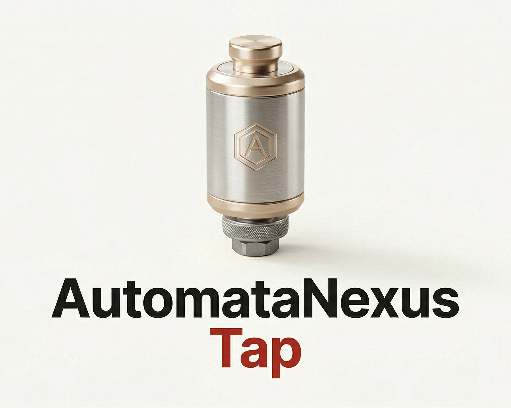

# AutomataNexus Homebrew Tap

<p align="center">
  
</p>

<p align="center">
  <a href="https://github.com/AutomataNexus/homebrew-tap"></a>
  <a href="https://github.com/AutomataNexus/homebrew-tap/tree/main/Formula"></a>
  <a href="https://github.com/AutomataNexus/homebrew-tap"></a>
</p>

Official [Homebrew](https://brew.sh) tap for [AutomataNexus](https://github.com/AutomataNexus) tools. One tap, all our public binaries.

---

## Setup

```bash
brew tap automatanexus/tap
```

## Available Formulae

| Formula | Description | Version | Platforms |
|---------|-------------|---------|-----------|
| [`nexusfoundry`](Formula/nexusfoundry.rb) | Hailo NPU model compiler — ONNX/TFLite/PyTorch/AxonML to HEF | 0.1.0 | Linux, macOS |
| [`axonml`](Formula/axonml.rb) | Pure Rust ML framework — training, inference, CUDA GPU | 0.4.2 | Linux, macOS |
| [`ferrum`](Formula/ferrum.rb) | Component-based email framework — type-safe templates | 0.1.0 | Linux, macOS |
| [`nexusshield`](Formula/nexusshield.rb) | Adaptive zero-trust security gateway + endpoint protection | 0.4.3 | Linux x86_64 |
| [`nexussentinel`](Formula/nexussentinel.rb) | Facility health assessment — MLP autoencoder for edge | 0.2.0 | Linux x86_64 |

---

## Install

```bash
# Install any formula
brew install automatanexus/tap/<formula>

# Or tap first, then install by name
brew tap automatanexus/tap
brew install nexusfoundry axonml ferrum nexusshield nexussentinel
```

### NexusFoundry — Hailo model compiler

```bash
brew install automatanexus/tap/nexusfoundry
nexusfoundry compile model.onnx --target hailo8
```

### AxonML — ML framework

```bash
brew install automatanexus/tap/axonml
axonml-cli --version
```

### Ferrum — Email framework

```bash
brew install automatanexus/tap/ferrum
ferrum --version
```

### NexusShield — Security gateway

```bash
brew install automatanexus/tap/nexusshield
nexus-shield --version
```

### NexusSentinel — Facility health

```bash
brew install automatanexus/tap/nexussentinel
```

---

## Update

```bash
brew update
brew upgrade    # upgrades all formulae
```

## Uninstall

```bash
brew uninstall <formula>
brew untap automatanexus/tap    # remove the tap entirely
```

---

## About AutomataNexus

AutomataNexus builds AI infrastructure for edge deployment — model compilers, inference engines, security systems, and monitoring platforms for Hailo NPU, NVIDIA Jetson, and custom hardware.

[GitHub](https://github.com/AutomataNexus) | [Contact](mailto:devops@automatanexus.com)
